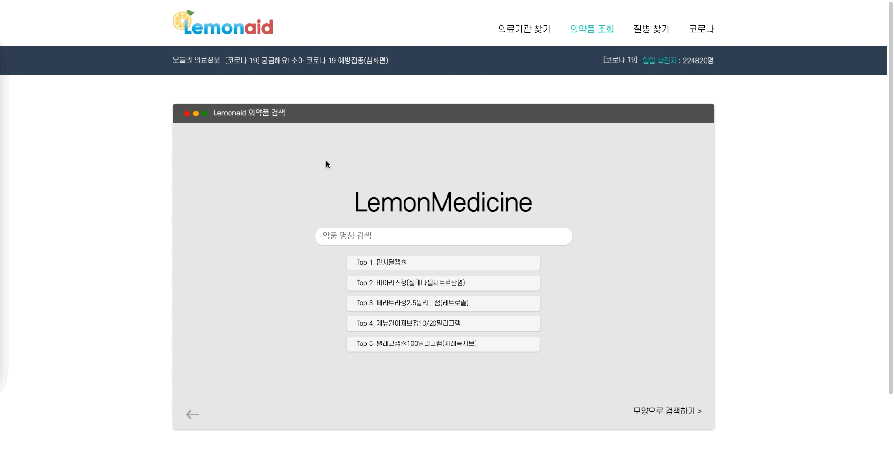
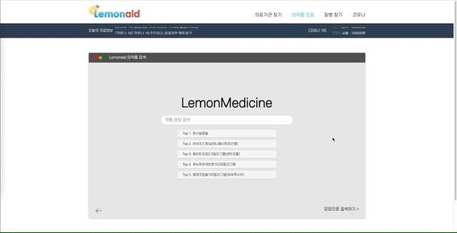
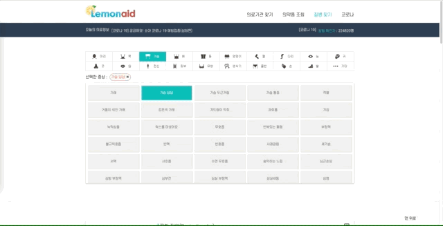
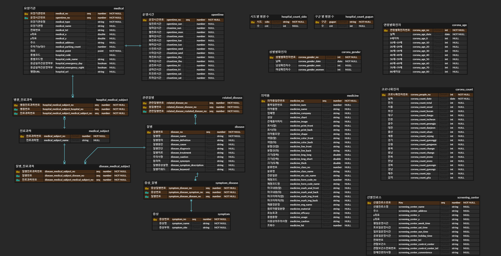

# :lemon: Lemonaid

## :sunny: **기획배경**

> 몸에 이상 징후가 있을 경우, 그에 대한 질병을 알기가 쉽지 않습니다.
>
> 질병을 알아도 어떤 병원에서 해당 질병을 진료해주는지 알기 어렵습니다.
>
> 처방받은 약에 대한 정보를 얻을 방법이 제한적입니다.
>
> 그래서 이를 해결할 Lemonaid를 기획하게 되었습니다.

## :ghost: **서비스 주요내용**

- 주소 기반 주변의 의료시설 조회(병원종류, 진료과목, 응급실 여부 등) 다양한 형태의 의료시설 정보 제공
- 선택한 증상에 대한 질병 조회
- 약의 생김새에 대한 해당 약의 정보 조회
- 현재 코로나 확진자 정보 조회

## :mega: **차별성**

- 사용자의 증상에 따른 질병 목록을 제공하고, 질병에 따라 진료 가능한 의료시설을 조회할 수 있다.
- 병원 규모, 진료종목에 따라 진료 중인 병원의 정보를 제공할 수 있다.
- 코로나 관련 의료기관(선별진료소 등)의 정보를 위치와 함께 제공 가능하다.

## :herb: **기대효과**

- 사용자의 건강과 직결되는 만큼, 신속하고 정확한 정보를 전달할 수 있다.
- 정보 전달 시, 해당 의료기관의 위치 뿐 아니라 진료과목 등 다양한 정보제공할 수 있다.
- 몸의 이상 징후에 따른 질병 정보를 제공할 수 있다.
- 복용 약의 상세 정보를 제공할 수 있다.
- 코로나 관련 정보를 제공할 수 있다.

## :cactus: **시연 및 시나리오**

- Lemonaid 시나리오는 [[시연 시나리오](./exec/시연시나리오.md)] 에서 더 자세히 보실 수 있습니다.

## :sparkler: Lemonaid **서비스 화면**

- Lemonaid 서비스의 메인 화면입니다.

- 다음은 의료기관 조회 화면입니다. 사용자위치 중심으로 맵이 자동으로 이동하고, 주변의 병원을 검색합니다. 주소입력을 통한 위치변경 기능도 제공합니다.

- 병원 종류, 진료 과목, 응급실 여부를 선택하여 해당하는 병원을 검색합니다. 약국 선택 시 약국을 검색합니다.

- 병원 상세보기 선택하면 해당 병원 정보가 나오고 지도 클릭 시 병원까지 길찾기가 실행됩니다.

- 다음은 의약품 조회 화면입니다. 사용자들이 검색한 의약품 TOP5리스트가 나타납니다.

- 약품명으로 검색 시 해당하는 약품 리스트가 검색됩니다. 초기화 시 원래 화면으로 돌아갑니다.

- 모양으로 검색 시 해당하는 약품 리스트가 검색됩니다. 약품 선택 시 상세정보 화면으로 바뀝니다.

- 다음은 증상 조회 화면입니다. 부위 별로 증상이 바뀌는 것을 확인할 수 있습니다.

- 증상은 최대 6개 선택가능하고 선택한 증상에 따라 검색되는 질병결과가 바뀝니다.

- 증상 선택 시 상세정보 화면으로 바뀌고, 상세정보 화면에서 지도 선택 시 의료기관 화면으로 전환됩니다.

- 다음은 코로나 정보 조회화면입니다. 날짜, 나이, 지역, 성별에 대한 정보를 그래프로 보여줍니다.

# 개발환경

## Frontend

- IDE: VSCode
- Node JS 16.13.x
- Language: HTML5, Javascript, CSS3
- Library: React 17.0.2, SCSS, TypeScript, Axios, Redux
- Open API: Kakao Map API

## Backend

- IDE: IntelliJ 2021.3.1
- Language: Java 1.8, Python 3.9
- Framework: Spring Boot 2.4.5
- Library: Spring Boot JPA, Spring Security, pandas

## Data

- MySQL 8.0.28
- Hadoop 3.3.1
- Sqoop 1.4.7

## Server

- Ubuntu 20.04 LTS
- Jenkins 2.332.1
- Nginx 1.18.0
- Docker 20.10.13
- Docker-compose 1.29.2

## Other Tools

- 회의록 : Notion
- 코드 관리: GitLab
- 일정 관리: Jira
- 와이어프레임: Figma
- 시퀀스 다이어그램: Mermaid
- ERD 작성: ERDCloud
- 회의 : Webex, Mattermost, Discord

## 서비스 아키텍처

## ER Diagram

## 안녕즈 팀

### 박승원

팀장을 맡아 프로젝트를 진행하는 것이 처음이여서 많은 것이 낯설었습니다. 회의를 진행하며, 프로젝트가 다른 길로 접어들지 않도록 길잡이의 역할을 하기도 하고, 수많은 의견을 조율하고 더 나은 의견을 이끌어내는 것이 쉽지만은 않았습니다. 그래도 기간이 지날 수록 팀원들과 의사소통하는 방법을 깨닫고, 서로 응원과 격려하는 분위기를 만드는 것에 묘한 희열을 느끼며, 한층 성장한 것 같습니다. 이를 계기로 다음의 프로젝트에서는 더 나은 팀장의 모습을 보여줄 수 있을 것 같습니다.

빅데이터 프로젝트인 만큼 수많은 데이터를 수집하고 이를 처리하는 과정이 매우 어렵고 복잡했습니다. 빅데이터에 미치진 못했지만 수많은 데이터를 처리하여 우리에게 필요한 데이터를 추출하고 분산처리하는 과정을 통해 데이터 분야에 더욱 관심을 가지게 된 것 같습니다. 앞으로 프로젝트를 진행할 때는 스파크와 같은 다른 빅데이터 라이브러리도 함께 사용해보고 싶습니다.

### 지수연

하둡을 간단한 Word Count에만 사용하게 되어서 아쉬운 점은 있었지만 많은 양의 데이터를 가지고 프로젝트를 진행하다보니 데이터를 어떻게 하면 좀 더 빠르고 보기 좋게 제공할 수 있을까에 대한 생각을 할 수 있게 된 계기가 되었습니다. 또한 배포 과정에 대해 좀 더 익숙해질 수 있어 좋았고, 팀원분들이 각각의 역할을 묵묵히 해나주셔서 물흐르듯이 지나갈 수 있었던 것 같습니다. 재밌었습니다!

### 이진곤

빅데이터라는 주제를 처음 다뤄보는지라 난관이 많았지만, 데이터 수집 과정부터 전처리, 분산처리를 거쳐 DB에 두고 프로젝트에 녹여내기까지 일련의 과정을 배울 수 있는 좋은 경험이었습니다.
스프링 부트로 백엔드를 개발하는 데에도 점점 능숙해지는 것 같고, 이전 프로젝트에서 해보고 싶었지만 하지 못했던 배포 과정도 직접 다뤄볼 수 있어서 좋았습니다.
든든한 팀원들 덕분에 훌륭한 프로젝트를 만들어내는 좋은 경험을 할 수 있었던 것 같습니다. 다음 프로젝트에도 열심히 임하여 좋은 결과물을 만들어내고 싶습니다.

### 이종현

빅데이터 분산이라는 도메인으로 아이디어를 도출해내기 힘들었는데 실생활에 도움이 될 수 있는 좋은 아이디어를 찾은 것 같아 뿌듯했습니다. 다소 부족한 시간이었지만 팀원들과의 협업을 통해 잘 마무리할 수 있었던 것 같습니다. React를 2번째로 사용해봤는데 이제는 많이 익숙해졌습니다. 팀원들과의 협동이 중요하다는 것을 다시 한번 깨달을 수 있었던 프로젝트였던 것 같습니다.

### 이상현

주제선정이 늦어졌음에도 팀원들 모두가 열심히하는 분위기여서 초기에 기획했던대로 결과물을 완성할 수 있었습니다.
피드백을 주고 받으면서 프로젝트를 진행했기 때문에 혼자선 생각하지 못했던 부분들을 찾을 수 있었습니다.
프로젝트 진행하다보니 중간중간에 API 수정 요청도 자주 했었는데 빨리 수정해줘서 고마웠습니다.
리액트와 타입스크립트에 대해 한층 더 공부할 수 있었습니다. 다음 프로젝트 진행하는데 큰 도움이 될 것 같습니다.

### 이수환

빅데이터라고 할 수준의 데이터 양이 아니었음에도 불구하고 해당 데이터를 수집하고 정제하여 분산처리 하는 것이 쉽지 않았습니다. 이 경험을 통해서 빅데이터를 분산처리하는 작업이 서비스를 운영하고 사용자의 경험을 향상시키기 위해 매우 주요하다는 것을 느낄 수 있었습니다.

React와 Typescript 역시 처음 활용하다보니 적응하는데 시간이 걸렸으나 팀원들이 잘 도와준 덕분에 빠르게 적응해서 작업을 진행할 수 있었습니다. 하지만 Typescript를 지원하지 않는 라이브러리를 활용하는 과정에서 해결하지 못하고 사용하지 못한 부분이 발생했는데 추가적인 학습을 통해 다음 프로젝트에서 보다 완성도 높은 결과물을 얻을 수 있도록 하겠습니다.
