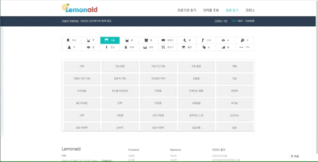

# :lemon: Lemonaid

## :sunny: **기획배경**

> 몸에 이상 징후가 있을 경우, 그에 대한 질병을 알기가 쉽지 않습니다. 
>
> 질병을 알아도 어떤 병원에서 해당 질병을 진료해주는지 알기 어렵습니다. 
>
> 처방받은 약에 대한 정보를 얻을 방법이 제한적입니다.
>
> 그래서 이를 해결할 Lemonaid를 기획하게 되었습니다.    

## :ghost: **서비스 주요내용**

- 주소 기반 주변의 의료시설 조회(병원종류, 진료과목, 응급실 여부 등) 다양한 형태의 의료시설 정보 제공 
- 선택한 증상에 대한 질병 조회 
- 약의 생김새에 대한 해당 약의 정보 조회 
- 현재 코로나 관련 정보( 선별 진료소, 국민 안심병원 등 정보제공)     

## :mega: **차별성**

- 사용자의 증상에 따른 질병 목록을 제공하고, 질병에 따라 진료 가능한 의료시설을 조회할 수 있다.
- 병원 규모, 진료종목에 따라 진료 중인 병원의 정보를 제공할 수 있다. 
- 코로나 관련 의료기관(선별진료소 등)의 정보를 위치와 함께 제공 가능하다. 

## :herb: **기대효과**

- 사용자의 건강과 직결되는 만큼, 신속하고 정확한 정보를 전달할 수 있다. 
- 정보 전달 시, 해당 의료기관의 위치 뿐 아니라 진료과목 등 다양한 정보제공할 수 있다. 
- 몸의 이상 징후에 따른 질병 정보를 제공할 수 있다.
- 복용 약의 상세 정보를 제공할 수 있다. 
- 코로나 관련 정보를 제공할 수 있다.     

## :cactus: **시연 및 시나리오**

- Lemonaid 시나리오는 [[시연 시나리오](./exec/시연시나리오.md)] 에서 더 자세히 보실 수 있습니다.   

## :sparkler: Lemonaid **서비스 화면**

- Lemonaid 서비스의 메인 화면입니다. 

- 다음은 의료기관 조회 화면입니다. 사용자위치 중심으로 맵이 자동으로 이동하고, 주변의 병원을 검색합니다. 주소입력을 통한 위치변경 기능도 제공합니다. 

- 병원 종류, 진료 과목, 응급실 여부를 선택하여 해당하는 병원을 검색합니다. 약국 선택 시 약국을 검색합니다. 

- 병원 상세보기 선택하면 해당 병원 정보가 나오고 지도 클릭 시 병원까지 길찾기가 실행됩니다.   

- 다음은 의약품 조회 화면입니다. 사용자들이 검색한 의약품 TOP5리스트가 나타납니다.

- 약품명으로 검색 시 해당하는 약품 리스트가 검색됩니다. 초기화 시 원래 화면으로 돌아갑니다.

- 모양으로 검색 시 해당하는 약품 리스트가 검색됩니다. 약품 선택 시 상세정보 화면으로 바뀝니다. 

- 다음은 증상 조회 화면입니다. 부위 별로 증상이 바뀌는 것을 확인할 수 있습니다.

- 증상은 최대 6개 선택가능하고 선택한 증상에 따라 검색되는 질병결과가 바뀝니다.

- 증상 선택 시 상세정보 화면으로 바뀌고, 상세정보 화면에서 지도 선택 시 의료기관 화면으로 전환됩니다.

- 다음은 코로나 정보 조회화면입니다. 날짜, 나이, 지역, 성별에 대한 정보를 그래프로 보여줍니다.

# 개발환경

## Frontend
- IDE: VSCode
- Node JS 16.13.x
- Language: HTML5, Javascript, CSS3
- Library: React 17.0.2, SCSS, TypeScript, Axios, Redux
- Open API: Kakao Map API

## Backend
- IDE: IntelliJ 2021.3.1
- Language: Java 1.8, Python 3.9
- Framework: Spring Boot 2.4.5
- Library: Spring Boot JPA, Spring Security, pandas

## Data
- MySQL 8.0.28
- Hadoop 3.3.1
- Sqoop 1.4.7

## Server
- Ubuntu 20.04 LTS
- Jenkins 2.332.1
- Nginx 1.18.0
- Docker 20.10.13
- Docker-compose 1.29.2

## Other Tools
- 회의록 : Notion
- 코드 관리: GitLab
- 일정 관리: Jira
- 와이어프레임: Figma
- 시퀀스 다이어그램: Mermaid
- ERD 작성: ERDCloud
- 회의 : Webex, Mattermost, Discord

## 서비스 아키텍처

## ER Diagram

## 팀 Lemonaid

