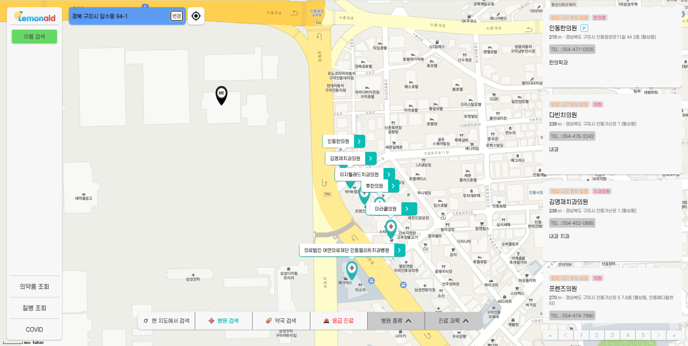
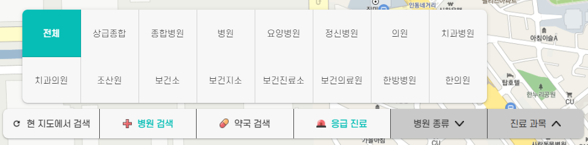
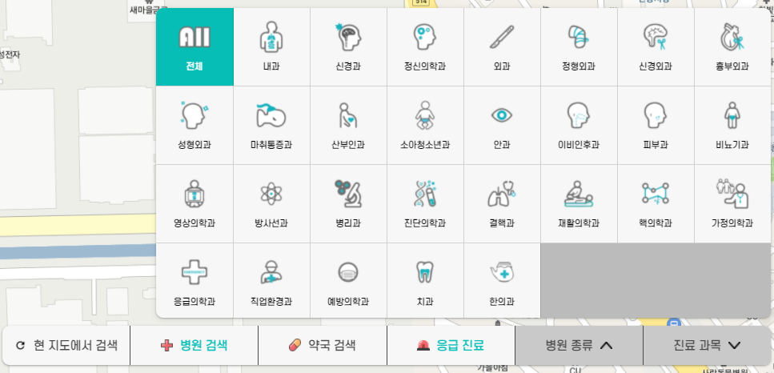
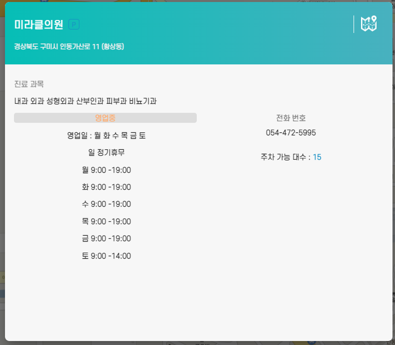

# 시연 시나리오

## 메인

.png>)

- 좌측의 청진기 컴포넌트 오른쪽의 텍스트를 클릭 하거나 화면 우측에서 스크롤을 통해 각각의 메뉴에 접근할 수 있습니다.
- 화면 맨 우측의 햄버거 메뉴를 클릭하거나, 스크롤 구간 있는 각각의 사진을 클릭하면 각 기능 페이지로 이동합니다.

## 의료기관 조회

- 현재 위치 기반의 주변 의료기관 정보를 지도와 목록으로 표시합니다.
- 중앙의 아래쪽에 위치한 버튼을 클릭하여 병원, 약국, 응급실을 필터링하여 검색할 수 있고,
  
  
  병원의 종류와 진료 과목 또한 선택가능합니다.
- 오른쪽의 목록, 혹은 지도 상의 마커를 클릭할 경우 상세 페이지가 표시됩니다.
  
- 오른쪽 상단의 현재 위치가 표시된 곳의 변경 버튼 또는 아이콘을 통해 현재 위치를 변경할 수 있습니다.
- 오른쪽 상단의 이름 검색을 통해 원하는 의료기관을 검색할 수 있습니다.
- 왼쪽 하단의 메뉴들을 통해 각각의 페이지로 이동할 수 있습니다.
