# 시퀀스 다이어그램

### 1. 주변 의료 정보 조회

1-1. 주변 전체 의료 기관 정보 조회

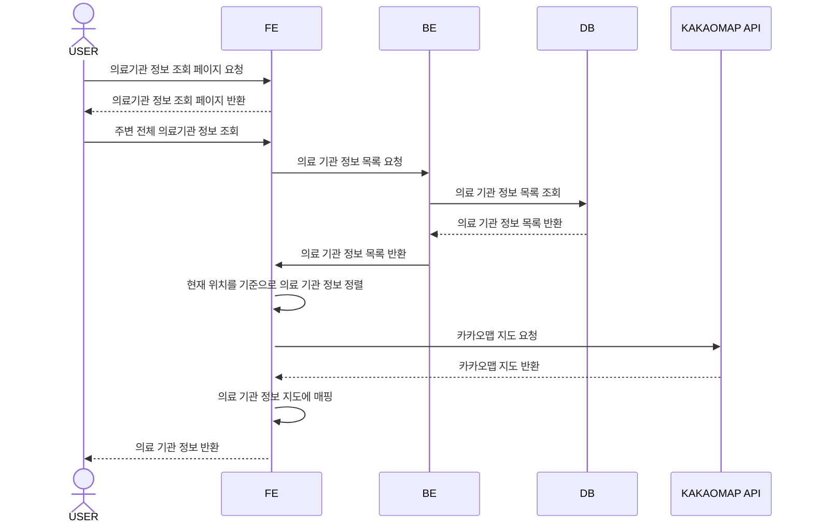

1-2. 옵션 별 의료 기관 조회

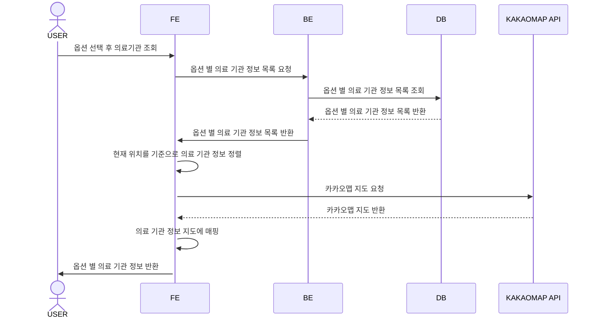

1-3. 현재 위치 기반 의료기관 조회

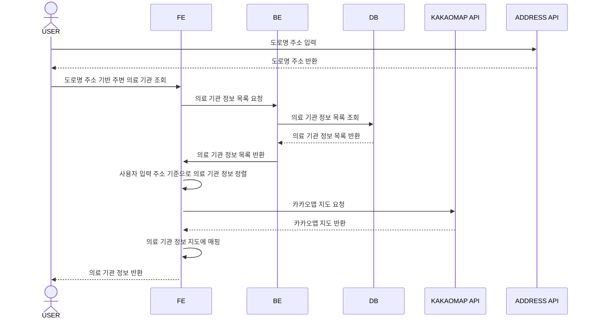

1-4. 의료기관 상세 조회

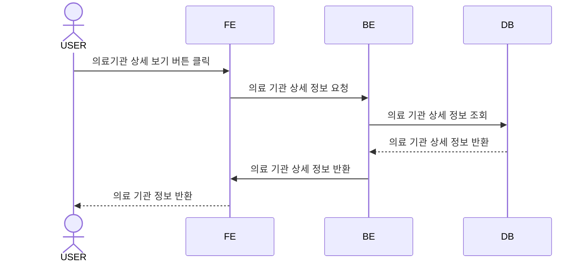

### 2. 코로나 정보 조회

2-1. 코로나 선별 진료소 조회

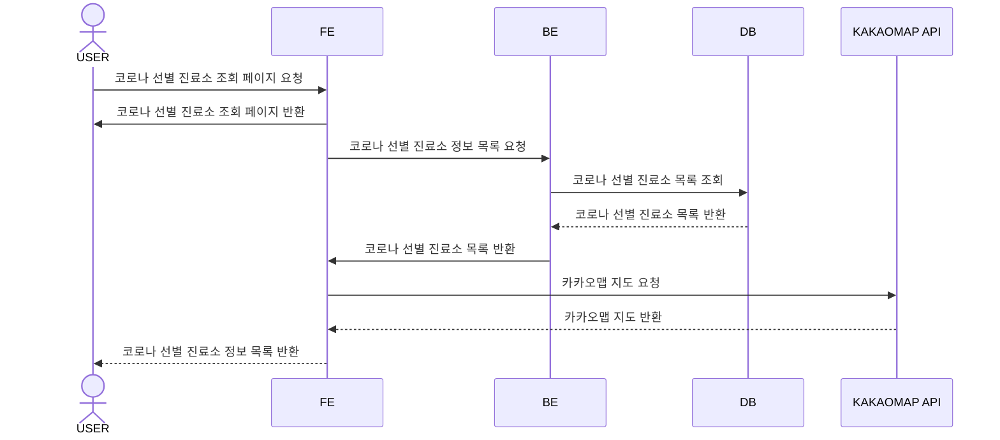

2-2. 코로나 확진자 정보 조회

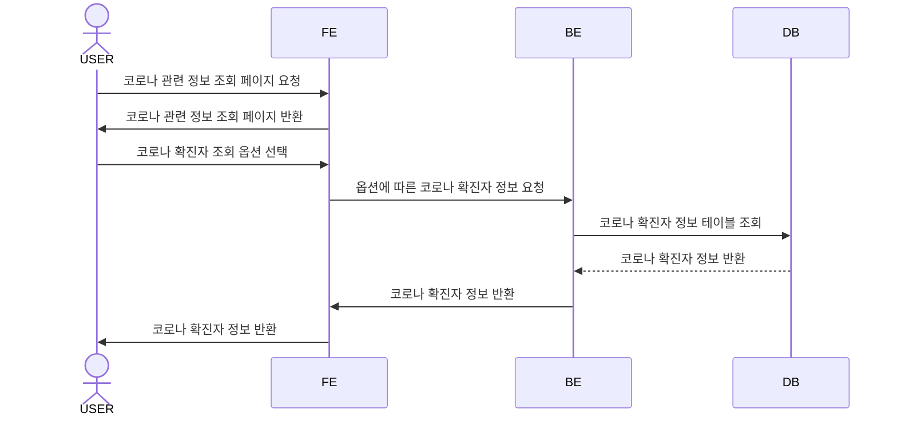

2-3. 코로나 방역 수칙 정보 조회

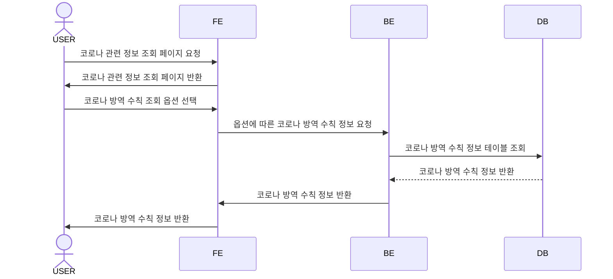

2-4. 코로나 주변 병의원 정보 조회

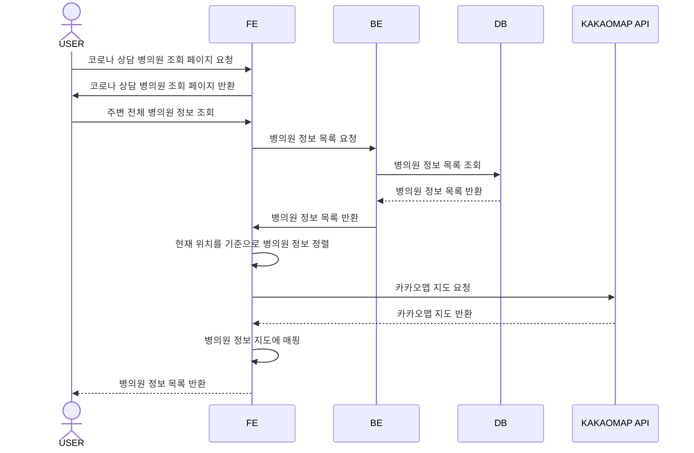

### 3. 증상에 따른 질병 정보 조회

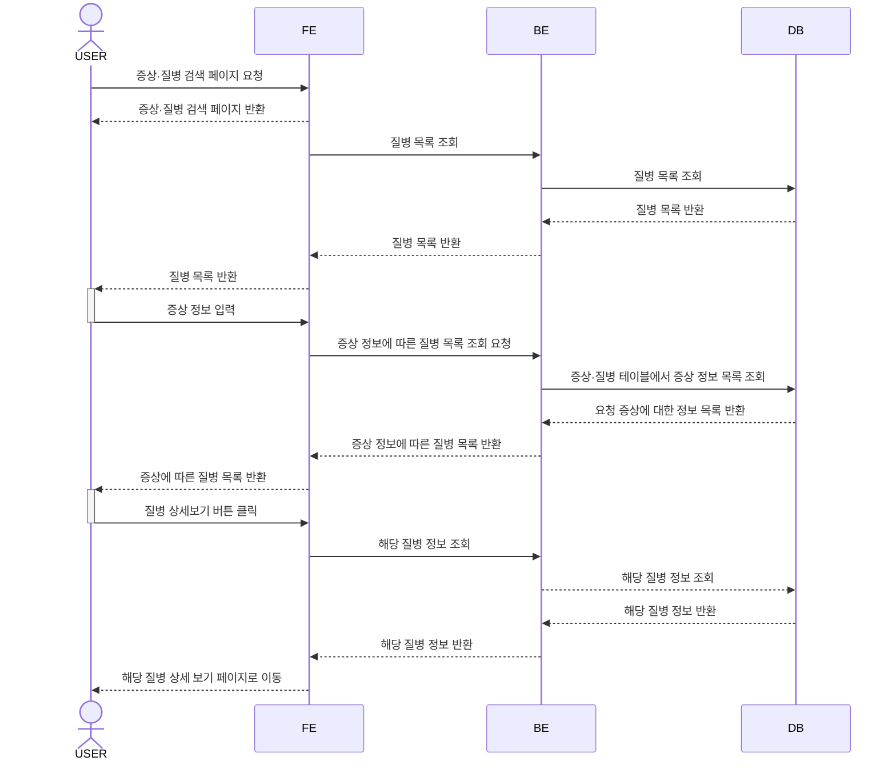

### 4. 의약품 정보 조회

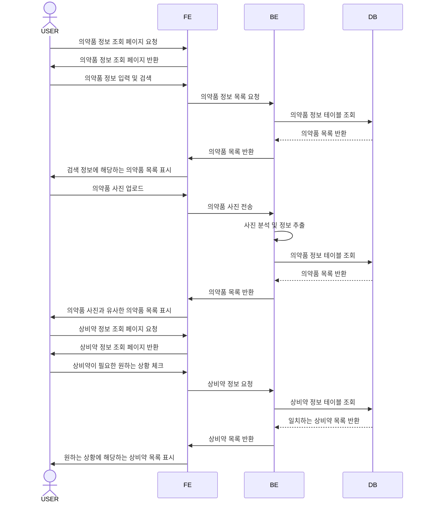

### 5. 보험 청구 여부 / 진료비 예상 금액 조회

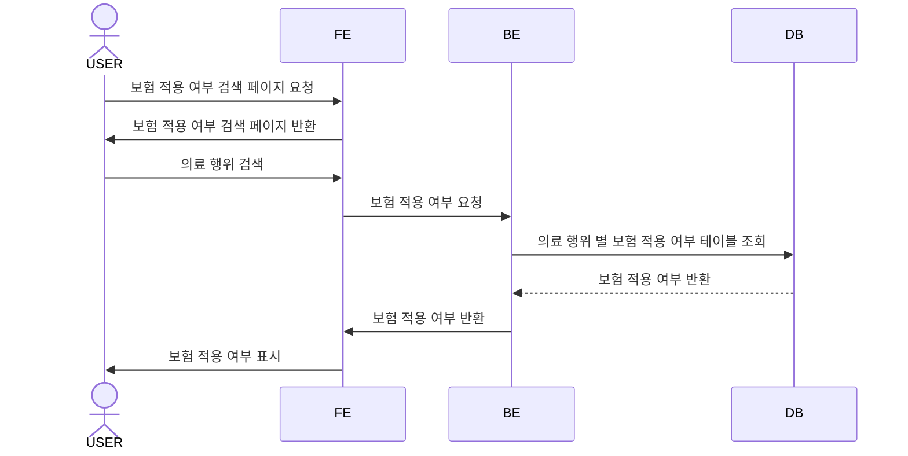

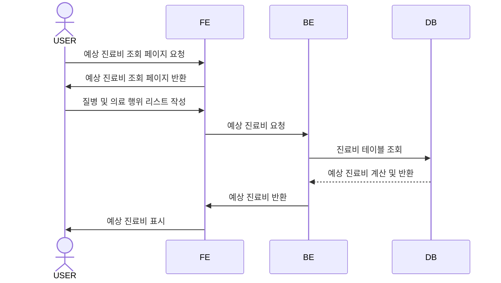
